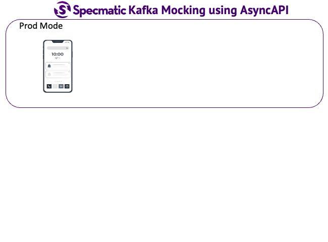

# Specmatic Studio Demo

Specmatic Studio is a tool for API design and testing. This demo showcases how to use Specmatic Studio to contract test
a simple [order API backend-for-frontend](https://github.com/specmatic/specmatic-order-bff-java). The [order-api-bff](https://github.com/specmatic/specmatic-order-api-java) is a backend service that interacts with an
order service.




## Prerequisites

* Docker & Docker Compose installed

# Usage

1. Clone the repository:
   ```bash
   git clone https://github.com/specmatic/studio-demo
   ```

2. Navigate to the project directory, and start the compose services
   ```bash
   cd studio-demo
   docker-compose up
   ```

3. Open [Specmatic Studio](http://localhost:9000/_specmatic/studio) in your browser:
   ```bash
   http://localhost:9000/_specmatic/studio
   ```
